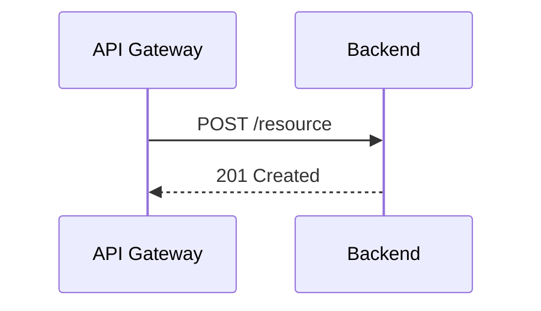
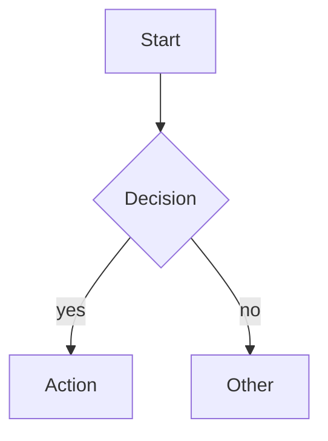
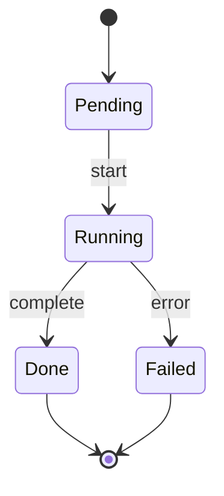
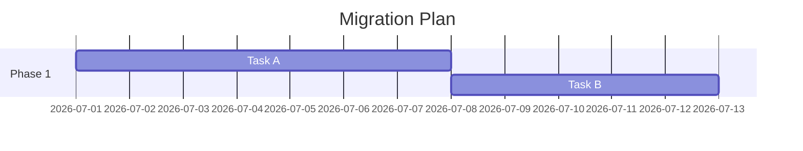

# Mermaid Best Practices
Use for `.mmd` files and fenced ` ```mermaid ` blocks. Output fenced code blocks unless writing a standalone `.mmd` file.

## Choose the right diagram
| Need | Type |
|---|---|
| Service/API interaction | `sequenceDiagram` |
| Decisions, pipelines, topology | `flowchart TD` or `flowchart LR` |
| Type or data model | `classDiagram` or `erDiagram` |
| Lifecycle/state machine | `stateDiagram-v2` |
| Time-series or category comparison | `xychart-beta` |
| Schedule | `gantt` |
| Timeline | `timeline` |
| Infrastructure topology | `architecture-beta` |
| Branch history | `gitGraph` |

## Syntax patterns
Sequence:


Flowchart:


State:


Gantt:


## Rules
- Keep one concept per diagram. Split large diagrams.
- Use short labels; put detail in prose or notes.
- Make node IDs unique. Labels may repeat.
- Quote labels containing `:`, `#`, `/`, `&`, `?`, `=`, or `(`.
- Keep arrow direction consistent unless bidirectional flow is intentional.
- Avoid subgraphs deeper than two levels.
- In sequence diagrams, declare readable participants with `participant X as Label`.
- In flowcharts, choose one edge-label style and stick to it.
- For `xychart-beta`, data point count must match category count.
- For `gantt`, always set `dateFormat` and use `after <id>` for dependencies.
- For Obsidian note links in Mermaid, add `class NodeName internal-link;`.

## Before finishing
- Verify every referenced node is declared.
- Add a title when the diagram will stand alone in docs or Confluence.
- Note beta diagram types (`xychart-beta`, `sankey-beta`, `architecture-beta`) if syntax risk matters.
