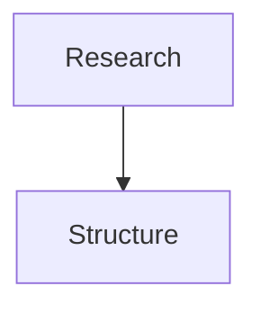

# presenterm
Use this skill for Markdown decks that must render in [`presenterm`](https://mfontanini.github.io/presenterm/).

## Basics
- A deck is one Markdown file.
- Start every deck with the standard frontmatter below. It creates the intro slide and sets the default palette and options. Use it unless the user asks for a different palette:

  ```yaml
  ---
  title: Presentation title
  sub_title: Optional subtitle
  author: Name
  theme:
    name: dark
    override:
      default:
        colors:
          background: "17102b"
          foreground: "e8e6f2"
      headings:
        h1:
          colors:
            foreground: "a884e6"
          bold: true
        h2:
          colors:
            foreground: "c9b6ee"
        h3:
          colors:
            foreground: "9b8cc7"
      intro_slide:
        title:
          colors:
            foreground: "a884e6"
        author:
          colors:
            foreground: "e8e6f2"
  options:
    h1_slide_titles: true
    implicit_slide_ends: true
    list_item_newlines: 2
  ---
  ```

- Option effects:
  - `implicit_slide_ends: true`: every heading begins a new slide. Use `<!-- end_slide -->` on its own line only to end a slide that must not continue into the next heading.
  - `h1_slide_titles: true`: the first `# H1` of each slide is the slide title. presenterm styles it as a title, not as a body heading.
  - `list_item_newlines: 2`: presenterm puts one blank line between list items.
- Theme hex colors have no `#` prefix.
- Keep slides short. Terminal slides have less space than browser slides.
- Prefer short bullets, small code blocks, and ASCII diagrams.

## Useful commands
presenterm uses single-line HTML comments as commands:

```markdown
<!-- pause -->
<!-- incremental_lists: true -->
<!-- incremental_lists: false -->
<!-- jump_to_middle -->
<!-- alignment: center -->
<!-- no_footer -->
<!-- skip_slide -->
<!-- font_size: 2 -->
<!-- speaker_note: Presenter-only note. -->
```

Use `presenterm --list-comment-commands` to check the installed version.

## Columns
Use presenterm column commands, not raw HTML layouts:

```markdown
<!-- column_layout: [1, 1] -->
<!-- column: 0 -->

### Before
- Broad prompt
- Too many docs

<!-- column: 1 -->

### After
- One page
- Code-backed claims

<!-- reset_layout -->
```

## Mermaid and diagrams
Do not assume Obsidian Mermaid works in presenterm.

Obsidian renders this as a diagram, but presenterm shows it as code unless rendering is enabled:

````markdown

```mermaid
flowchart TD
  A --> B
```
````

presenterm Mermaid rendering needs `+render` and Mermaid CLI (`mmdc`):

````markdown

```mermaid +render +width:80%
flowchart TD
  A[Research] --> B[Structure]
```
````

Mermaid CLI uses Puppeteer/Chromium, so rendering can be slow or fail in locked-down environments. For portable Obsidian + presenterm decks, prefer ASCII diagrams:

````markdown
```text
Human                         LLM
-----                         ---
Set goal + truth rules   -->  research code
Correct assumptions      <--  propose structure
Approve scope            -->  draft
Challenge claims         <--  verify + rewrite
```
````

Use pre-rendered images only when the diagram must be visual.

## Images
- Image paths are relative to the deck file.
- Images require a terminal image protocol: kitty graphics, iTerm2 images, or sixel.
- Compatible terminals include Kitty, iTerm2, WezTerm, Ghostty, and foot.
- If rendering fails, use `--image-protocol` or replace the image with text.

## Font size
Use `font_size` for the rest of the current slide:

```markdown
<!-- font_size: 2 -->
```

Values range from `1` to `7`; `1` is the default. Font sizing depends on terminal support. The upstream docs call out Kitty support as of Kitty `0.40.0`. If unsupported, presenterm ignores the command. The portable fallback is increasing the terminal font size and reducing slide density.

## Obsidian compatibility
When a deck lives in Obsidian, avoid syntax that presenterm cannot render reliably:

- `[[wikilinks]]`
- `![[embeds]]`
- Obsidian-only Mermaid blocks
- long tables
- callouts that must render specially

Plain Markdown, fenced code blocks, and ASCII diagrams work in both tools.

## Validation checklist
Before returning a presenterm deck:

1. Confirm the frontmatter has the standard theme and options.
2. Confirm each slide begins with a heading, or the previous slide ends with `<!-- end_slide -->`.
3. Replace Mermaid with ASCII unless `mmdc` is available and requested.
4. Check image paths are relative to the deck.
5. Keep each slide short enough for a terminal.
6. Run or suggest:

   ```bash
   presenterm path/to/deck.md
   ```
